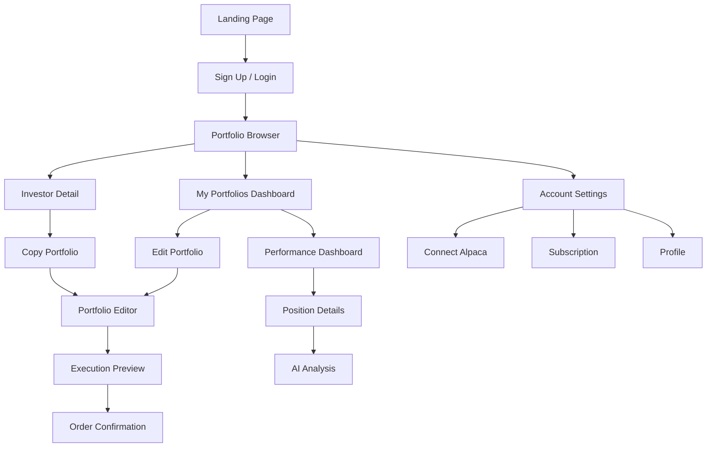
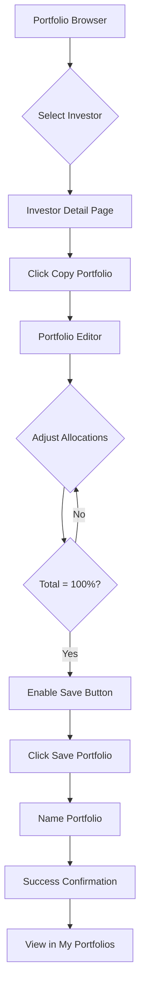
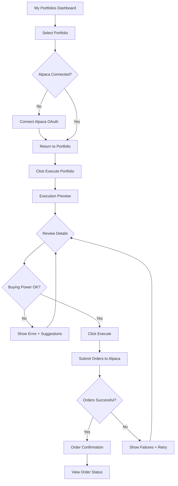
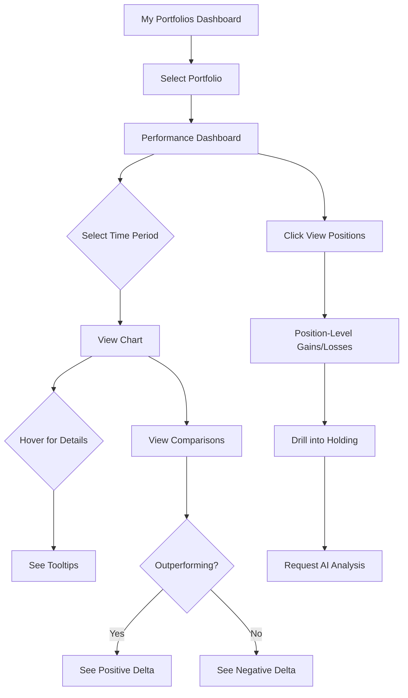

# Invest with Billionaires - UI/UX Specification

## Introduction

This document defines the user experience goals, information architecture, user flows, and visual design specifications for Invest with Billionaires' user interface. It serves as the foundation for visual design and frontend development, ensuring a cohesive and user-centered experience.

### Document Purpose

This specification translates product requirements into a concrete design system featuring a unique aesthetic: **sophisticated Gameboy minimalism with tactile hardware inspiration and 8-bit nostalgia**. Drawing inspiration from iconic music hardware like the Teenage Engineering EP-133, this design direction differentiates Invest with Billionaires from traditional fintech platforms through warmth, nostalgia, tactile interaction design, and honest simplicity.

### Change Log

| Date | Version | Description | Author |
|------|---------|-------------|---------|
| 2025-10-17 | 1.0 | Initial UI/UX specification with design system | Sally (UX Expert) |
| 2025-10-29 | 1.1 | Updated with EP-133 tactile hardware design patterns | Sally (UX Designer) |

---

## Overall UX Goals & Principles

### Target User Personas

**Primary: Semi-Sophisticated Retail Investor**
- Age: 25-45
- Investment experience: 2-5 years, comfortable with stocks
- Pain point: Overwhelmed by research, wants to learn from institutional investors
- Goal: Copy proven strategies without spending 5 hours researching 13F filings
- Tech comfort: High, uses mobile/desktop interchangeably
- Values: Authenticity, simplicity, not being patronized

**Secondary: Aspiring Investor**
- Age: 22-35
- Investment experience: 0-2 years, starting investing journey
- Pain point: Intimidated by complexity of investment research
- Goal: Learn by following experts, build confidence
- Tech comfort: Very high, mobile-first
- Values: Education, community, approachable design

### Usability Goals

1. **Onboarding Simplicity**: New user can copy first portfolio within 10 minutes
2. **Allocation Clarity**: 100% allocation constraint understood intuitively without instruction
3. **Execution Confidence**: User feels informed and secure clicking "Execute Portfolio"
4. **Performance Transparency**: User understands portfolio performance vs. benchmarks at a glance
5. **AI Insight Accessibility**: User can trigger and consume AI analysis without friction

### Design Principles

1. **One Action Per Screen**
   - Each screen has ONE clear primary action
   - Secondary actions subtle and non-competing
   - Reduces decision paralysis, increases completion rates

2. **Honest Authenticity**
   - Embrace data imperfections (45-day lag acknowledged)
   - Hand-drawn illustrations add human touch and energy
   - Playful yet professional visual language
   - Never fake precision or certainty

3. **Tactile Interaction Design**
   - Hardware-inspired UI elements (buttons feel clickable, 3D depth)
   - Modular grid layouts like music equipment panels
   - LED displays for critical numbers
   - Status indicators (small colored dots) for system state
   - Warm, approachable, empowering
   - Familiar patterns create comfort in financial decisions

4. **Generous Breathing Room**
   - White space prioritized over information density
   - Minimal UI chrome, content-focused
   - Calm, confident presentation reduces anxiety
   - Mobile and desktop equally spacious

5. **Progressive Disclosure**
   - Show only what's needed for current task
   - Details available but not forced
   - Order history, advanced options: accessible but not prominent
   - Complexity revealed as user progresses

---

## Branding & Design System

### Visual Identity

**Core Aesthetic**: Sophisticated hardware minimalism with tactile interaction design and 8-bit nostalgia

**Brand Personality**: Empowering, energetic, authentic, confident, approachable, honest, playful

**Visual References**:
- Teenage Engineering EP-133 (modular button grids, tactile 3D elements)
- Gameboy LCD green palette (sophisticated, not garish)
- Linear's minimalist clarity
- Hand-drawn energetic illustrations (bold line art)
- Retro LED scoreboards and 7-segment displays
- Music hardware interface design (knobs, buttons, segmented displays)

### Color Palette

| Color Type | Hex Code | RGB | Usage |
|------------|----------|-----|-------|
| **Primary** | `#9BBC0F` | rgb(155, 188, 15) | Main actions, success states, gains, primary buttons |
| **Accent** | `#FFB30F` | rgb(255, 179, 15) | Highlights, warnings, attention, important info |
| **Background** | `#F7F3E9` | rgb(247, 243, 233) | Main page background (cream/paper texture) |
| **Text Primary** | `#2A2823` | rgb(42, 40, 35) | Body text, headings (warm black) |
| **Text Secondary** | `#6B6860` | rgb(107, 104, 96) | Supporting text, captions (muted gray) |
| **Neutral Gray** | `#8B8680` | rgb(139, 134, 128) | Borders, dividers, inactive states |
| **Success (Gains)** | `#9BBC0F` | rgb(155, 188, 15) | Positive returns, upward trends |
| **Warning** | `#FFB30F` | rgb(255, 179, 15) | Cautions, validation errors |
| **Danger (Losses)** | `#C13B3B` | rgb(193, 59, 59) | Negative returns, downward trends (muted, not harsh) |
| **Info** | `#7A8C8E` | rgb(122, 140, 142) | Informational messages, neutral states |

**Color Usage Guidelines**:
- **Primary (Sage Green)**: Dominant brand color, use for CTAs, confirmations, success
- **Accent (Warm Amber)**: Sparingly for attention, warnings, highlights
- **Background (Cream)**: All page backgrounds, apply subtle paper texture
- **Neutrals**: Text hierarchy, borders, inactive states
- **Semantic Colors**: Consistent use (green=gains, red=losses, amber=warning)

### Typography

#### Font Families

**Primary (UI Text)**: **Berkeley Mono**
- Source: [Berkeley Mono](https://berkeleygraphics.com/typefaces/berkeley-mono/)
- Usage: All UI text, buttons, labels, navigation, body content
- Character: Sophisticated monospace, warm, readable
- Fallback: `'Berkeley Mono', 'IBM Plex Mono', 'Courier New', monospace`

**Data/Numbers**: **IBM Plex Mono**
- Source: [IBM Plex Mono](https://fonts.google.com/specimen/IBM+Plex+Mono)
- Usage: Portfolio values, percentages, stock prices, LED-style displays
- Character: Clean, precise, tabular figures
- Fallback: `'IBM Plex Mono', 'Courier New', monospace`
- Special: Apply subtle glow effect for LED display aesthetic

#### Type Scale

| Element | Size | Weight | Line Height | Letter Spacing | Usage |
|---------|------|--------|-------------|----------------|-------|
| **H1** | 48px | 700 | 1.2 | -0.02em | Page titles, hero sections |
| **H2** | 32px | 700 | 1.3 | -0.01em | Section headers |
| **H3** | 24px | 600 | 1.4 | 0 | Subsection headers |
| **H4** | 20px | 600 | 1.4 | 0 | Card headers, component titles |
| **Body Large** | 18px | 400 | 1.6 | 0 | Main content, descriptions |
| **Body** | 16px | 400 | 1.6 | 0 | Standard body text |
| **Body Small** | 14px | 400 | 1.5 | 0 | Supporting text, captions |
| **Caption** | 12px | 400 | 1.4 | 0.01em | Metadata, timestamps, disclaimers |
| **LED Display** | Variable | 500 | 1.2 | 0.02em | Numbers with LED glow effect |
| **Button** | 16px | 600 | 1.0 | 0.01em | Button labels (slightly tracked) |

**Typography Guidelines**:
- **Monospace Everywhere**: Consistent use of Berkeley Mono creates cohesive retro aesthetic
- **LED Numbers**: IBM Plex Mono with subtle text-shadow glow (`text-shadow: 0 0 8px rgba(155, 188, 15, 0.3)`)
- **Line Height**: Generous for readability (1.6-1.8 for body text)
- **Paragraph Spacing**: 1.5em between paragraphs
- **Mobile Scale**: Reduce font sizes by 10-15% on mobile (<768px)

### Iconography & Illustration

**Icon Library**: Custom minimalist icons + hand-drawn illustrations

**Icon Style Guidelines**:
- **Size Standards**: 16x16px (small), 24x24px (standard), 32x32px (large)
- **Aesthetic**: Clean geometric shapes with optional pixel-art treatment for retro elements
- **Color**: Monochrome (primary text color) or semantic colors (green/amber/red)
- **Rendering**: Crisp, minimal, purposeful

**Illustration Style** (NEW):
- **Aesthetic**: Bold line art, energetic hand-drawn characters and diagrams
- **Usage**: Hero sections, empty states, onboarding flows, feature explanations
- **Color**: Black line art with orange accent fills, occasional sage green
- **Personality**: Playful, energetic, empowering (inspired by EP-133 marketing materials)
- **Examples**: Illustrated investors as champions/energetic characters, technical diagram overlays, hand-pointing at interfaces

**Core Icon Set**:
- Navigation: Home, Portfolio, Analytics, Settings (16x16)
- Actions: Add, Remove, Edit, Save, Cancel, Refresh (16x16)
- Status: Checkmark, Warning, Error, Info (8x8)
- Directional: Arrows up/down/left/right, chevrons (8x8)
- Financial: Chart up, chart down, dollar sign, trophy (16x16)
- Investor Portraits: Pixelated headshots (32x32)
- Stock Symbols: Generic building/company icons (16x16)

**Implementation**:
- SVG format for scalability
- Inline SVG for critical icons (avoid HTTP requests)
- Icon sprite sheet for non-critical icons
- Alt text required for all meaningful icons
- Decorative icons: `aria-hidden="true"`

### Spacing & Layout

**Grid System**: 8px base unit grid

**Spacing Scale**:
```
xs:  4px   (0.5 units)
sm:  8px   (1 unit)
md:  16px  (2 units)
lg:  24px  (3 units)
xl:  32px  (4 units)
2xl: 48px  (6 units)
3xl: 64px  (8 units)
4xl: 96px  (12 units)
```

**Component Spacing**:
- Padding inside cards/containers: 16-24px
- Margin between components: 24-32px
- Section spacing: 48-64px
- Page margins: 16px (mobile), 32px (tablet), 48px (desktop)

**Layout Constraints**:
- Max content width: 1400px (centered)
- Optimal reading width: 800px (long-form content)
- Card grids: 2-4 columns depending on breakpoint
- Gutters: 16px (mobile), 24px (desktop)

**Wabi-Sabi Spacing**:
- Intentional slight asymmetry in margins (±2-4px)
- Hand-drawn borders: 1-2px irregular thickness
- Organic spacing variations create authentic feel

### Textures & Effects

**Background Texture**:
- Subtle paper grain overlay on cream background
- Opacity: 3-5% (barely perceptible)
- Pattern: Fine noise or paper texture
- Purpose: Warmth, tangibility, wabi-sabi authenticity

**Pixel Dithering**:
- Applied to gradients and shadows
- 8-bit style ordered dithering
- Creates retro aesthetic without harshness
- Usage: Background transitions, subtle shadows, dividers

**LED Glow Effect**:
- Applied to large numbers (portfolio value, prices)
- CSS: `text-shadow: 0 0 8px rgba(155, 188, 15, 0.3), 0 0 16px rgba(155, 188, 15, 0.1)`
- Color: Sage green (#9BBC0F) or amber (#FFB30F)
- Subtle, not aggressive

**Hand-Drawn Borders**:
- SVG filter for slight irregularity
- Border-width: 1-2px with subtle variations
- Purpose: Wabi-sabi imperfection, human touch
- Usage: Cards, buttons, containers

---

## Component Library

### Core Components

#### 1. Button

**Purpose**: Primary and secondary actions throughout the application

**Design Inspiration**: Tactile hardware buttons with 3D depth (inspired by EP-133 interface)

**Variants**:
- **Primary (Orange)**: Warm orange (#FF6B35 or #FFB30F), white text, dominant CTAs (COMMIT, EXECUTE, SAVE)
- **Main Action (Sage Green)**: Sage green (#9BBC0F), white text, secondary important actions
- **Dark**: Dark charcoal/black (#2A2823), white text, main functions
- **Light**: Light gray/white (#E8E6E0), dark text, secondary/tertiary actions
- **Danger**: Muted red (#C13B3B), white text, destructive actions

**States (Tactile 3D Design)**:
- **Default**:
  - Solid color with subtle 3D depth effect (1-2px bottom shadow/border)
  - Slightly raised appearance using CSS box-shadow
  - Rounded corners (6-8px, like hardware buttons)
- **Hover**:
  - Slight lift (2px translateY), shadow deepens
  - Subtle glow for orange/green buttons
  - Feels interactive and "pressable"
- **Active/Pressed**:
  - Pressed down (translateY: 0), shadow reduces
  - Darker shade (filter: brightness(0.9))
  - Tactile click feedback
- **Disabled**: 40% opacity, desaturated, no shadow (appears flat)
- **Loading**: Animated spinner or pulsing state

**Sizing**:
- Small: 32px height, 12px horizontal padding
- Medium: 40px height, 16px horizontal padding
- Large: 48px height, 24px horizontal padding
- **Touch-friendly**: Minimum 44x44px tap target on mobile

**Typography**:
- Berkeley Mono, 14-16px, 600 weight, uppercase for primary actions
- Slight letter-spacing (0.02em) for readability

**Visual Details**:
- Small status indicator dots (6px circles) can appear next to button text
- Orange buttons have priority in visual hierarchy
- Buttons in grids maintain modular alignment

**Accessibility**:
- Min contrast 4.5:1 (WCAG AA)
- Focus indicator: 2px solid outline, 2px offset
- Touch targets: Min 44x44px on mobile

**Usage Guidelines**:
- ONE primary orange button per screen max
- Use orange for commit/execute actions
- Dark buttons for mode selection/main functions
- Light buttons for cancel/secondary actions
- Button text: verb-based, uppercase for emphasis ("COPY PORTFOLIO", "EXECUTE", "SAVE")

---

#### 2. Input Field

**Purpose**: Text input for allocations, search, form fields

**Variants**:
- **Text**: Standard text input
- **Number**: LED-style display for percentages/amounts
- **Search**: With magnifying glass icon

**States**:
- **Default**: Light border (#8B8680), cream background
- **Focus**: Amber border (#FFB30F), subtle glow
- **Error**: Red border, shake animation, error message below
- **Success**: Green border, checkmark icon
- **Disabled**: Gray background, reduced opacity

**Typography**:
- Label: Berkeley Mono, 14px, 600 weight
- Input: IBM Plex Mono, 16px (numbers get LED glow)
- Placeholder: 50% opacity

**Accessibility**:
- Labels always visible (no placeholder-only)
- Error messages announced to screen readers
- Focus indicators clear and visible

---

#### 3. Card

**Purpose**: Container for investor profiles, portfolio holdings, comparison data

**Visual Style**:
- Background: Slightly darker cream (#F0ECE3)
- Border: 1-2px warm gray (#8B8680) with hand-drawn irregularity
- Border-radius: 8px with subtle pixel corners
- Padding: 16-24px
- Shadow: Subtle, dithered pixel shadow

**Variants**:
- **Investor Card**: Portrait, name, metrics, CTA button
- **Holding Card**: Ticker, company, allocation, controls
- **Comparison Card**: Benchmark data, deltas, icons

**Hover State**:
- Lift 4px
- Shadow deepens
- Subtle scale (1.01)
- Smooth transition (200ms)

**Wabi-Sabi Details**:
- Hand-drawn border (slight imperfections)
- Subtle position variations in grids (±2-4px)
- Each card feels unique

---

#### 4. Slider

**Purpose**: Allocation adjustment in portfolio editor

**Visual Style**:
- Track: Thin (4px), neutral gray, pixel-textured
- Fill: Sage green (#9BBC0F), shows current value
- Handle: Chunky (24px), rounded with pixel corners, raised
- Labels: Current value (LED-style), min/max endpoints

**States**:
- **Default**: Neutral colors
- **Hover**: Handle enlarges slightly (26px)
- **Active**: Handle glows, track thickens (6px)
- **Disabled**: Desaturated, no interaction

**Behavior**:
- Smooth dragging with subtle "stepped" feel (0.1% increments)
- Keyboard accessible (arrow keys: 0.1%, shift+arrow: 1%)
- Touch-friendly (min 44x44px tap target)

---

#### 5. Progress Bar / Allocation Indicator

**Purpose**: Show total allocation percentage (must equal 100%)

**Visual Style**:
- Large LED-style number (48-72px IBM Plex Mono)
- Color: Sage green at 100%, amber if ≠100%
- Progress bar: Horizontal, shows completion to 100%
- Subtle pulsing glow when invalid

**States**:
- **Valid (100%)**: Sage green, gentle glow, success vibe
- **Invalid (<100%)**: Amber, pulse animation, "X% remaining" message
- **Invalid (>100%)**: Amber, pulse animation, "Reduce by X%" message

---

#### 6. Tooltip / Info Popup

**Purpose**: Contextual help, hover details, disclaimers

**Visual Style**:
- Background: Dark warm gray (#3A3833)
- Text: Cream color, Berkeley Mono, 12-14px
- Border: Subtle hand-drawn pixel border
- Arrow: Pixel-art pointer to trigger element
- Max-width: 240px

**Behavior**:
- Appears on hover (desktop) or tap (mobile)
- Dismisses on focus loss or second tap
- Animation: Gentle fade-in (150ms)

---

#### 7. Modal / Dialog

**Purpose**: Confirmation dialogs, detailed views, important messages

**Visual Style**:
- Overlay: Dark transparent (#000000 at 40%)
- Modal: Cream background, hand-drawn border, centered
- Max-width: 600px
- Padding: 32px
- Close button: Pixel-art × icon (16x16)

**Content Structure**:
- Icon (optional, 32x32 pixel-art)
- Title (H3, Berkeley Mono bold)
- Body text (16px, generous line-height)
- Actions (primary + secondary buttons)

**Behavior**:
- Appears with gentle scale + fade (300ms)
- ESC key closes
- Click outside closes (optional)
- Focus trap within modal

---

#### 8. Data Table / List

**Purpose**: Holdings list, order details, performance data

**Visual Style**:
- Layout: Clean list (not dense table), generous spacing
- Headers: Berkeley Mono, 14px, 600 weight, uppercase
- Rows: 16px, 400 weight, 48px min-height
- Dividers: Subtle dithered lines (1px)
- Alternating rows: No zebra striping (clean)

**Interactive Elements**:
- Sortable columns: Click header, pixel-art arrow (8x8)
- Hover: Row background slightly darker
- Select: Checkbox (custom pixel-art style)

**Responsive**:
- Desktop: Multi-column table layout
- Mobile: Card-based list (stack columns vertically)

---

#### 9. Chart / Data Visualization

**Purpose**: Performance tracking, portfolio comparisons

**Visual Style**:
- Background: Cream with subtle grid (pixel dithering)
- Lines: Sage green (user), dashed gray (comparison)
- Points: Small pixel dots (4x4)
- Axes: Berkeley Mono labels, minimal grid
- Organic: Slight hand-drawn irregularity in lines

**Interactive**:
- Hover: Crosshair pixel cursor (8x8), tooltip with LED numbers
- Zoom: Pinch or scroll (optional)
- Responsive: Scales gracefully on mobile

---

#### 10. Status Indicators (NEW)

**Purpose**: Show system state, connection status, active modes (inspired by EP-133 indicator dots)

**Visual Style**:
- Small colored dots (6-8px diameter circles)
- Solid fill, subtle glow effect optional
- Positioned near labels or within buttons

**Colors**:
- **Orange (#FFB30F)**: Active, recording, processing
- **Green (#9BBC0F)**: Connected, success, ready
- **Red (#C13B3B)**: Error, disconnected, warning
- **Gray (#8B8680)**: Inactive, off, neutral

**Usage Examples**:
- Connection status: "● Connected to Alpaca" (green dot)
- Active mode: "● LIVE TRADING" vs "○ Paper Trading" (filled vs empty)
- Processing state: Pulsing orange dot during execution
- Multiple states: Row of dots showing multi-step progress

**Animation**:
- Pulse effect for active/processing states (scale 1 → 1.2 → 1, 1s loop)
- Fade in/out for status changes (300ms transition)

---

#### 11. Loading States

**Purpose**: Indicate async operations, data fetching

**Visual Style**:
- Skeleton screens: Light gray shapes matching content
- Spinner: Minimal rotating circle or pixel-art animation
- Progress bar: For multi-step operations

**Variants**:
- **Inline**: Small spinner (16x16)
- **Full-page**: Centered, larger animation (32x32)
- **Button**: "Loading..." text with mini spinner or pulsing orange dot

---

## Information Architecture

### Site Map



### Navigation Structure

**Primary Navigation** (Top Bar):
- Logo (left, pixel-art)
- Browse Investors
- My Portfolios
- Account (dropdown)

**User Menu** (Dropdown):
- Performance Dashboard
- Settings
- Help / FAQ
- Logout

**Breadcrumb Strategy**:
- Visible on detail pages: Browser > Warren Buffett > Edit Portfolio
- Berkeley Mono, small text, pixel-art › separator
- Clickable for navigation back

---

## User Flows

### Flow 1: Copy & Customize Portfolio

**User Goal**: Discover an institutional investor, copy their portfolio, customize allocations, and save.

**Entry Points**:
- Landing page CTA
- Portfolio Browser grid
- Investor Detail page

**Success Criteria**:
- User saves customized portfolio with 100% allocation
- User understands what they customized vs. original

**Flow Diagram**:



**Edge Cases & Error Handling**:
- User exits editor without saving: Show "Unsaved changes" warning
- User tries to save with ≠100%: Disable button, show amber warning
- User adds invalid ticker: Validation error, reject addition
- API failure during save: Retry prompt, data preserved locally

---

### Flow 2: Execute Portfolio

**User Goal**: Review portfolio execution details and submit orders to brokerage.

**Entry Points**:
- My Portfolios Dashboard ("Execute" button)
- Portfolio Editor ("Save & Execute" option)

**Success Criteria**:
- User successfully submits orders to Alpaca
- User receives confirmation of order placement
- User understands execution timing (market hours)

**Flow Diagram**:



**Edge Cases & Error Handling**:
- Insufficient buying power: Block execution, suggest reduction or deposit
- Market closed: Warning about order queueing, still allow submission
- Some orders fail: Show partial success, allow retry for failed orders
- Alpaca API timeout: Retry logic, status check, contact support option

---

### Flow 3: Monitor Performance

**User Goal**: Check portfolio performance and compare to institutional benchmark.

**Entry Points**:
- My Portfolios Dashboard
- Performance Dashboard link in navigation
- Email notification (milestone alert)

**Success Criteria**:
- User understands current portfolio value and returns
- User sees comparison to Buffett and S&P 500
- User can drill into position-level details

**Flow Diagram**:



**Edge Cases & Error Handling**:
- No performance data yet (new portfolio): Educational message, "check back tomorrow"
- Data loading failure: Retry button, cached data if available
- Comparison data unavailable: Show user data only, note benchmark unavailable

---

## Wireframes & Screen References

### Design Files

**Primary Design Files**: [Link to Figma/Sketch when available]

For now, screen designs are defined in individual UI prompt documents:
- [01-portfolio-browser.md](./ui-prompts/01-portfolio-browser.md)
- [02-portfolio-editor.md](./ui-prompts/02-portfolio-editor.md)
- [03-execution-preview.md](./ui-prompts/03-execution-preview.md)
- [04-performance-dashboard.md](./ui-prompts/04-performance-dashboard.md)
- [05-ai-analysis-view.md](./ui-prompts/05-ai-analysis-view.md)

Each prompt file contains:
- Detailed AI generation prompt for tools like v0.dev, Lovable
- Screen purpose and user goals
- Design rationale and component details
- Responsive considerations
- Accessibility requirements
- API endpoint mapping

---

## Accessibility Requirements

### Compliance Target

**Standard**: WCAG 2.1 Level AA compliance

**Why AA**: Balances strong accessibility with practical implementation, meets most legal requirements (ADA, Section 508).

### Key Requirements

**Visual**:
- **Color Contrast**:
  - Text: 4.5:1 minimum (body text on cream background: #2A2823 on #F7F3E9 = 9.8:1 ✓)
  - Large text (18px+): 3:1 minimum
  - UI components: 3:1 minimum (buttons, borders, icons)
  - Sage green buttons on cream: (#9BBC0F on #F7F3E9 = 4.1:1 ✓)
- **Focus Indicators**:
  - Visible on all interactive elements
  - 2px solid sage green (#9BBC0F) outline
  - 2px offset from element
  - Never rely on color alone
- **Text Sizing**:
  - Base font: 16px minimum (18px preferred)
  - Zoomable to 200% without loss of functionality
  - Responsive text scales appropriately

**Interaction**:
- **Keyboard Navigation**:
  - All interactive elements keyboard accessible (Tab, Enter, Space, Arrow keys)
  - Logical tab order (left-to-right, top-to-bottom)
  - Skip links to main content
  - ESC key closes modals/dropups
  - Arrow keys adjust sliders (fine: 0.1%, coarse: 1%)
- **Screen Reader Support**:
  - Semantic HTML (`<nav>`, `<main>`, `<article>`, etc.)
  - ARIA labels for icon buttons and complex widgets
  - ARIA live regions for dynamic content updates (allocation total, order status)
  - Alt text for all meaningful images (pixel-art portraits, icons)
  - Decorative images: `aria-hidden="true"` or empty alt
- **Touch Targets**:
  - Minimum 44x44px (mobile)
  - 48x48px preferred
  - Adequate spacing between tap targets (8px minimum)

**Content**:
- **Alternative Text**:
  - All investor portraits: "Warren Buffett pixel art portrait"
  - Charts: Descriptive alt text summarizing data
  - Icons: Meaningful labels or aria-label
- **Heading Structure**:
  - Logical hierarchy (H1 → H2 → H3, no skipping levels)
  - One H1 per page (page title)
  - Section headers use appropriate heading levels
- **Form Labels**:
  - Visible labels for all inputs (no placeholder-only)
  - Associated with inputs via `<label for="id">`
  - Required fields indicated with text (not just asterisk)
  - Error messages clearly associated with fields

### Testing Strategy

**Automated Testing**:
- Lighthouse accessibility audits (CI/CD integration)
- axe DevTools during development
- Pa11y for regression testing

**Manual Testing**:
- Keyboard-only navigation testing
- Screen reader testing (NVDA, JAWS, VoiceOver)
- Color blindness simulation (Colorblind filters)
- Zoom testing (200%, 400%)

**User Testing**:
- Include users with disabilities in usability testing
- Test with assistive technology users
- Iterate based on real accessibility feedback

---

## Responsiveness Strategy

### Breakpoints

| Breakpoint | Min Width | Max Width | Target Devices | Layout Strategy |
|------------|-----------|-----------|----------------|-----------------|
| **Mobile** | 320px | 767px | Phones | Single column, stacked elements, full-width cards |
| **Tablet** | 768px | 1023px | Tablets, small laptops | 2-column grids, some side-by-side content |
| **Desktop** | 1024px | 1439px | Laptops, desktops | 3-4 column grids, side-by-side layouts |
| **Wide** | 1440px+ | - | Large displays | Max-width 1400px centered, generous margins |

### Adaptation Patterns

**Layout Changes**:
- **Mobile**: Single column, stacked cards, collapsible sections
- **Tablet**: 2-column grids, some side-by-side (editor comparison)
- **Desktop**: Multi-column grids, persistent navigation, side-by-side views

**Navigation Changes**:
- **Mobile**: Hamburger menu (pixel-art icon), bottom navigation option
- **Tablet/Desktop**: Horizontal top navigation, persistent visibility

**Content Priority**:
- **Mobile-first**: Most important content first, progressive disclosure
- **Hiding**: Secondary actions/info collapsed on mobile, expandable
- **Reordering**: Visual hierarchy may shift (hero metrics stacked on mobile)

**Interaction Changes**:
- **Mobile**: Touch-friendly targets (min 44x44px), larger buttons, simplified sliders
- **Desktop**: Hover states, tooltips, keyboard shortcuts
- **Gestures**: Swipe for carousel/tabs on mobile, click/drag on desktop

### Design Tokens for Responsive

```scss
// Breakpoints
$breakpoint-mobile: 320px;
$breakpoint-tablet: 768px;
$breakpoint-desktop: 1024px;
$breakpoint-wide: 1440px;

// Typography scales
$font-size-h1-mobile: 32px;
$font-size-h1-desktop: 48px;

$font-size-body-mobile: 15px;
$font-size-body-desktop: 16px;

// Spacing
$spacing-mobile: 16px;
$spacing-desktop: 32px;

// Container max-widths
$container-max: 1400px;
$content-max: 800px; // reading width
```

---

## Animation & Micro-interactions

### Motion Principles

1. **Subtle and Purposeful**: Animations enhance understanding, not distraction
2. **Retro-Inspired**: Subtle 8-bit callbacks (stepped animations, pixel transitions)
3. **Performance-First**: GPU-accelerated, 60fps target, respect `prefers-reduced-motion`
4. **Fast and Snappy**: Durations 150-300ms (faster than typical web), feels responsive

### Key Animations

**Page Transitions**:
- **Type**: Gentle fade-in
- **Duration**: 200ms
- **Easing**: ease-out
- **Purpose**: Smooth entry, avoid jarring flashes

**Card Hover**:
- **Type**: Lift (translateY: -4px) + shadow deepening
- **Duration**: 150ms
- **Easing**: ease-out
- **Purpose**: Indicate interactivity, invite click

**Button Click**:
- **Type**: Press down (translateY: 1px) + slightly darker shade
- **Duration**: 100ms
- **Easing**: ease-in
- **Purpose**: Tactile feedback, confirm interaction

**Allocation Total Indicator**:
- **Type**: Color shift + gentle pulse when invalid
- **Duration**: 500ms (pulse loop)
- **Easing**: ease-in-out
- **Purpose**: Draw attention to validation state

**Number Updates** (LED-style):
- **Type**: Gentle flicker effect (opacity: 0.8 → 1)
- **Duration**: 150ms
- **Easing**: linear
- **Purpose**: Retro LED display aesthetic, indicate change

**Modal Appearance**:
- **Type**: Scale (0.95 → 1) + fade-in
- **Duration**: 250ms
- **Easing**: ease-out
- **Purpose**: Smooth, non-jarring dialog entry

**Loading Spinner**:
- **Type**: Pixel-art rotating animation (stepped, 8 frames)
- **Duration**: 800ms loop
- **Easing**: steps(8) (discrete 8-bit frames)
- **Purpose**: Retro aesthetic, indicates loading

**Error Shake**:
- **Type**: Horizontal shake (translateX: -8px → 8px → 0)
- **Duration**: 400ms
- **Easing**: ease-in-out
- **Purpose**: Alert user to invalid input

**Skeleton Loading**:
- **Type**: Pulsing opacity (0.4 → 0.8)
- **Duration**: 1200ms loop
- **Easing**: ease-in-out
- **Purpose**: Indicate content loading, reduce perceived wait

### Reduced Motion

**Respect User Preferences**:
```css
@media (prefers-reduced-motion: reduce) {
  * {
    animation-duration: 0.01ms !important;
    transition-duration: 0.01ms !important;
  }
}
```

**Alternative Feedback**:
- Replace animations with instant state changes
- Keep color/size changes (no motion)
- Loading indicators: static or simple fade

---

## Performance Considerations

### Performance Goals

- **Page Load (Initial)**: < 2 seconds (perceived), < 3 seconds (fully loaded)
- **Interaction Response**: < 100ms (button press), < 500ms (API calls)
- **Animation FPS**: 60fps minimum, no dropped frames
- **Time to Interactive (TTI)**: < 3 seconds

### Design Strategies for Performance

**Image Optimization**:
- Pixel-art icons: SVG format (small file size, crisp at any scale)
- Investor portraits: Optimized PNGs or WebP (32x32 = tiny)
- Lazy load images below fold
- Use srcset for responsive images

**Font Loading**:
- `font-display: swap` to avoid FOIT (Flash of Invisible Text)
- Subset fonts (only include needed characters)
- Preload critical fonts (Berkeley Mono, IBM Plex Mono)

**Component Loading**:
- Code splitting: Load editor components only when needed
- Skeleton screens for perceived performance
- Cache API responses aggressively

**Animation Performance**:
- Use `transform` and `opacity` (GPU-accelerated)
- Avoid `width`, `height`, `top`, `left` animations (triggers layout)
- `will-change` hint for animated elements (sparingly)

**Data Visualization**:
- Limit chart data points (sample large datasets)
- Use canvas for complex charts (better than SVG for many elements)
- Debounce hover interactions (avoid excessive repaints)

---

## Next Steps

### Immediate Actions

1. **Review with Stakeholders**
   - Product team: Validate user flows and feature prioritization
   - Engineering: Discuss feasibility of design system and animations
   - Accessibility specialist: Review compliance strategy

2. **Create High-Fidelity Mockups**
   - Use Figma/Sketch to create pixel-perfect designs based on specs
   - Build interactive prototypes for user testing
   - Generate design assets (icons, images, textures)

3. **Implement Design System**
   - Set up design tokens (CSS variables or Tailwind config)
   - Build component library in React (Storybook for documentation)
   - Create pixel-art icon sprite sheet

4. **User Testing**
   - Test prototypes with target users (semi-sophisticated investors)
   - Validate portfolio customization flow (most complex interaction)
   - Iterate based on feedback

5. **Handoff to Development**
   - Share Figma files with inspect mode
   - Provide design tokens and component specs
   - Collaborate on implementation details

### Design Handoff Checklist

- [ ] All user flows documented and validated
- [ ] Component inventory complete with all variants/states
- [ ] Accessibility requirements defined and reviewed
- [ ] Responsive strategy clear for all breakpoints
- [ ] Brand guidelines incorporated (colors, typography, iconography)
- [ ] Performance goals established and communicated
- [ ] Design assets exported (icons, textures, fonts)
- [ ] Interactive prototypes available for reference
- [ ] Developer documentation provided (design tokens, component specs)
- [ ] Feedback loop established for design QA during development

---

## Appendix: Design Rationale

### Why Gameboy Aesthetics for Fintech?

**Differentiation**:
- Fintech is saturated with blue/green gradients and sleek minimalism
- Gameboy aesthetic creates instant memorability and nostalgia
- Appeals to millennial/Gen Z investors who grew up with 8-bit gaming

**Emotional Connection**:
- Investing is stressful; nostalgia reduces anxiety
- Retro gaming = fun, exploration, leveling up (positive associations)
- Wabi-sabi authenticity builds trust (not hiding imperfections)

**Functionality**:
- Monospace typography improves number readability (tabular figures align)
- LED-style displays create focus on key metrics (portfolio value)
- Minimalism reduces cognitive load (one action per screen)
- Pixel-grid constraint enforces design discipline (intentional simplification)

### Balancing Retro with Sophistication

**Avoiding Childishness**:
- Conservative pixel art (not cartoonish sprites)
- Sophisticated color palette (muted Gameboy greens, not neon)
- Professional typography (Berkeley Mono, not pixel fonts everywhere)
- Generous spacing (not cramped 8-bit UI)

**Modern Fintech Standards**:
- WCAG AA accessibility compliance
- Responsive design for all devices
- Fast performance (no retro slowness)
- Real-time data (not turn-based game pace)

**Wabi-Sabi Balance**:
- Intentional imperfections (hand-drawn borders, organic spacing)
- Honest data presentation (acknowledge 45-day lag, price variability)
- Not sloppy or unprofessional (every asymmetry deliberate)

---

This specification provides the foundation for implementing the unique visual identity of Invest with Billionaires. Developers should reference this document alongside individual screen prompts in `/docs/design/ui-prompts/` for detailed implementation guidance.

**Questions or clarifications?** Contact Sally (UX Expert) or Product Manager.
